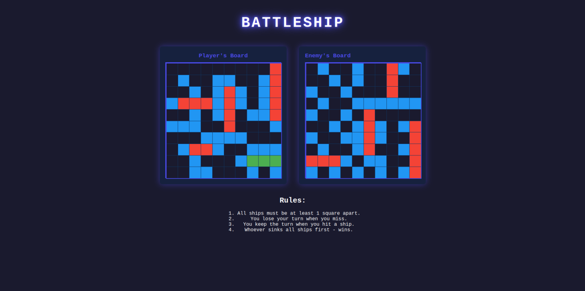
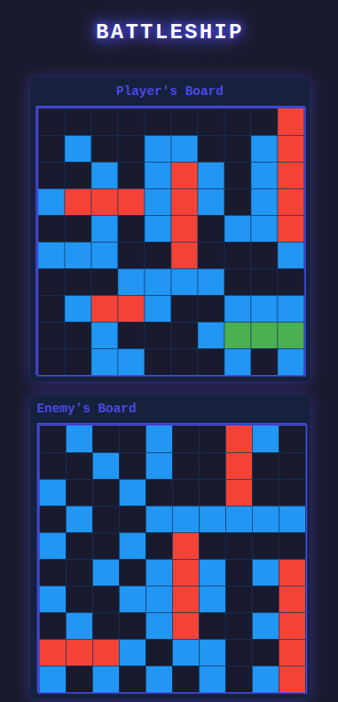

# Battleship

This Battleship game is designed to provide a fun and challenging experience for players. Built with HTML, CSS, and JavaScript, it features a dynamic interface where users can play against the computer.

## Features

- **Gameplay:** Players can place their ships on the board and take turns firing at the opponent's board.
- **AI Opponent:** The computer will make strategic moves to try and sink the player's ships.
- **Winning Condition:** The game ends when all of a player's ships have been sunk.
- **Responsive Design:** Mobile-friendly interface for better navigation on smaller screens.

## Technologies Used

- HTML
- CSS
- JavaScript
- Webpack

## Setup and Installation

1. **Clone the repository:**
   ```bash
   git clone https://github.com/NNikoGG/odin-battleship.git
   cd battleship
   ```
2. **Install dependencies**
   ```bash
   npm install
   ```
3. **Run the development server**
   ```bash
   npm start
   ```
   This will open the application in your default browser.
4. **Build for production:**
   ```bash
   npm run build
   ```
   This will generate a dist folder with the production-ready files.

## Usage

- **Placing Ships:** Click on the board to place your ships.
- **Firing Shots:** Click on the opponent's board to fire a shot.
- **Winning the Game:** Sink all of the opponent's ships to win the game.

### Gameplay



### Responsive Design


